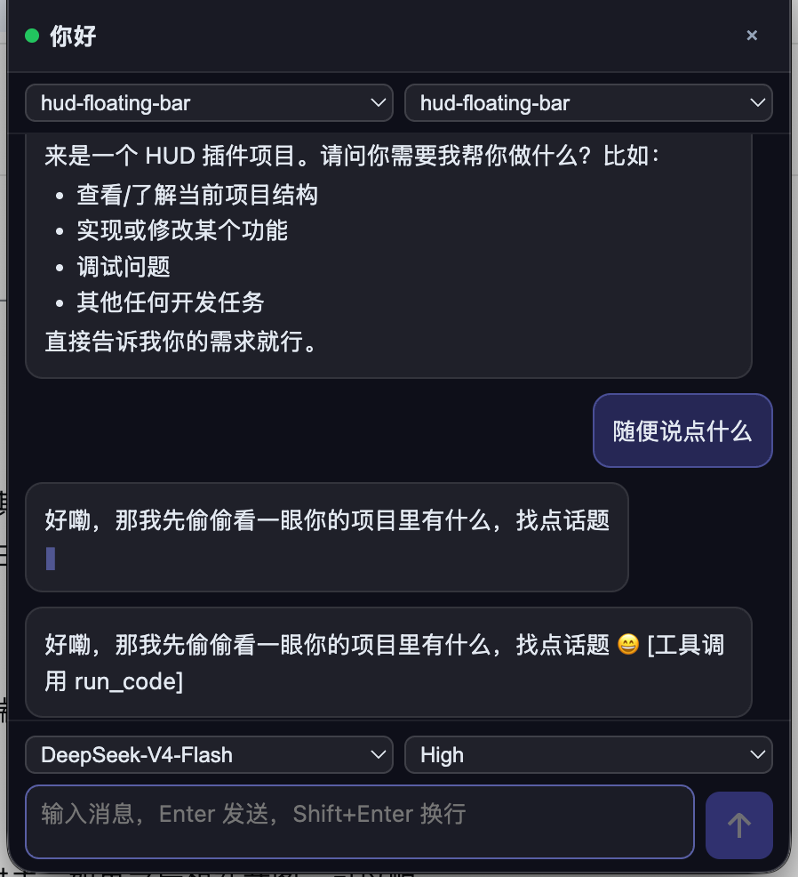

# HUD Floating Bar

An always-on-top floating HUD chat bar for DeepSeek Harness: live session transcript (markdown rendering, streaming output), workspace / session / model / reasoning-effort switching, and Picture-in-Picture (PiP) detach — pop the HUD into an OS-level always-on-top window (Chrome/Edge), usable over any other app.

[简体中文](README.zh-CN.md)

Official bundle plugin for [DeepSeek Harness](https://github.com/NousResearch/deepseek-harness).

## Features

- **Floating HUD bar** — draggable, resizable, always-on-top overlay inside the web UI
- **Live transcript** — realtime conversation with markdown rendering and streaming cursor; tool calls shown compactly
- **Switchers** — workspace / session / model (grouped by provider) / reasoning effort, also inline above the composer
- **Send / Stop generating** — the primary button turns into 停止生成 while the agent is running, like the main web composer
- **Approval notice** — a banner appears when any session awaits a permission approval, telling you to approve in the main UI
- **Picture-in-Picture detach** — Chrome/Edge 116+: pop the HUD into an OS-level always-on-top PiP window; works across other apps
- **Pin / follow** — pin the HUD to one session or follow the active one
- Keyboard: `Enter` send, `Shift+Enter` newline, `Esc` close (in-page)



## Install

Requires a DSH web profile (0.1.0-rc.6+).

From a local checkout (bundle dir contains the built artifacts):

```sh
dsh plugin --profile web add "/path/to/hud-floating-bar"
```

Or from git (artifacts checked in, one-line install):

```sh
dsh plugin --profile web add "github:blktea814/hud-bar-for-dsh#main"
```

Then **restart the web app**. The HUD bar appears at the top-left of the page; the sidebar footer also gets a toggle button.

## Usage

- Type a message, press `Enter` to send — the reply streams into the bar (and the main conversation, same session)
- Above the input: model / reasoning effort selectors; the primary button turns into 停止生成 while the agent runs
- Top row: status dot, session title, `外置` (PiP detach), pin/follow, close
- Second row: workspace / session selectors
- Drag the header to move, drag the bottom-right corner to resize
- `Esc` or `Ctrl+Shift+H` closes the in-page bar

## Package layout

```
hud-floating-bar/
├── package.json         # dsh.bundle + dsh.client manifest
├── cordis.patch.yml     # bundle layer: inserts the Node half
├── index.mjs            # Node half: /hud-api/* JSON endpoints
└── client/index.js      # browser bundle: HUD UI (__ModuleLoader__.load)
```

The Node half serves five same-origin endpoints:

| Endpoint | Purpose |
| --- | --- |
| `GET /hud-api/surface?sessionId=` | Incremental transcript rows + agent status + pending approvals |
| `POST /hud-api/send` | Send a user message (official agent inbox) |
| `GET /hud-api/model?sessionId=` | Model catalog + current selection |
| `POST /hud-api/set-model` | Switch model / reasoning effort (next turn) |
| `POST /hud-api/stop` | Stop the running agent |

## Notes

- PiP detach requires Chrome/Edge 116+ (`documentPictureInPicture`); Safari/Firefox fall back to the in-page bar.
- Model switches take effect on the next agent step and are also saved as the default selection.
- Permission approvals are handled by the official main-UI approval card; the HUD only notifies you when one is pending.

## License

MIT
